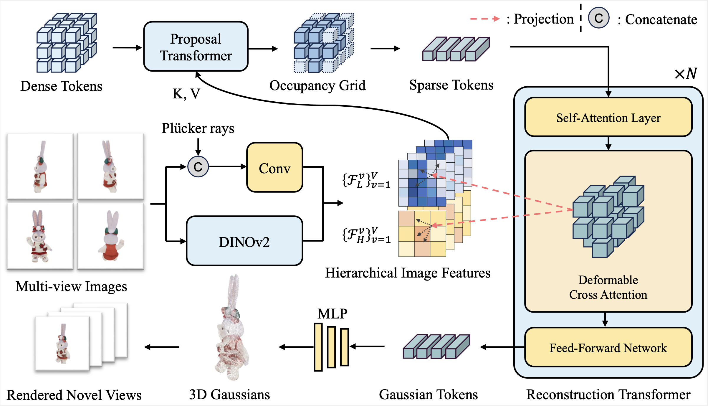

# [NeurIPS 2024] GeoLRM

**[Project Page](https://alibaba-yuanjing-aigclab.github.io/GeoLRM) | [arXiv](https://arxiv.org/abs/2406.15333) | [Paper](https://linshan-bin.github.io/GeoLRM/static/GeoLRM_arXiv.pdf) | [Checkpoint](https://huggingface.co/LinShan/GeoLRM/tree/main)**

> GeoLRM: Geometry-Aware Large Reconstruction Model for High-Quality 3D Gaussian Generation
>
> [Chubin Zhang](https://linshan-bin.github.io/), Hongliang Song, [Yi Wei](https://weiyithu.github.io/), Yu Chen, [Jiwen Lu](http://ivg.au.tsinghua.edu.cn/Jiwen_Lu/), [Yansong Tang](https://andytang15.github.io/)

**Updates:**

- `🔔 2024/6/21` Code release.
- `🎉 2024/9/29` GeoLRM has been accepted at NeurIPS 2024!
- `🔔 2024/9/30` Training code release.

## 🕹 Demos

3D assets generated by GeoLRM:

https://github.com/alibaba-yuanjing-aigclab/GeoLRM/assets/25566223/765e2113-b024-488c-ba36-24bc97803157

## 📝 Introduction

In this work, we introduce the Geometry-Aware Large Reconstruction Model (GeoLRM), an approach which can predict high-quality assets with 512k Gaussians and 21 input images in only 11 GB GPU memory. Previous works neglect the inherent sparsity of 3D structure and do not utilize explicit geometric relationships between 3D and 2D images. This limits these methods to a low-resolution representation and makes it difficult to scale up to the dense views for better quality. GeoLRM tackles these issues by incorporating a novel 3D-aware transformer structure that directly processes 3D points and uses deformable cross-attention mechanisms to effectively integrate image features into 3D representations. We implement this solution through a two-stage pipeline: initially, a lightweight proposal network generates a sparse set of 3D anchor points from the posed image inputs; subsequently, a specialized reconstruction transformer refines the geometry and retrieves textural details.

## 💡 Method

Method Pipeline:

<p align='center'>

</p>

The process begins with the transformation of dense tokens into an occupancy grid via a Proposal Transformer, which captures spatial occupancy from hierarchical image features extracted using a combination of a convolutional layer and DINOv2. Sparse tokens representing occupied voxels are further processed through a Reconstruction Transformer that employs self-attention and deformable cross-attention mechanisms to refine geometry and retrieve texture details with 3D to 2D projection. Finally, the refined 3D tokens are converted into 3D Gaussians for real-time rendering.

## 🔧 Installation

Clone this repo and install the dependencies:

1. Create a new conda environment and install the dependencies:

    ```bash
    conda create -n geolrm python=3.10
    conda activate geolrm
    conda install pytorch==2.1.2 torchvision==0.16.2 torchaudio==2.1.2 pytorch-cuda=12.1 -c pytorch -c nvidia
    pip install flash-attn --no-build-isolation
    pip install -r requirements.txt
    ```

2. Follow the instructions in [generative-models](https://github.com/Stability-AI/generative-models) to install the `sgm` package. (For SV3D inference.)

3. Build the `curopr3d` and `deform_attn_3d` CUDA extensions:

    ```bash
    cd src/models/decoder/curope3d
    python setup.py build_ext --inplace
    cd ../deform_attn_3d
    python setup.py build_ext --inplace
    ```

    If you encounter any issues, please make sure that the CUDA version used to compile the pytorch package and the CUDA version of your NVCC compiler are the same, which can be checked by running the following commands:

    ```bash
    nvcc --version
    python -c "import torch; print(torch.version.cuda)"
    ```

## 🚀 Quick Start

### Download checkpoints

Download the GeoLRM checkpoint:
```bash
wget https://huggingface.co/LinShan/GeoLRM/resolve/main/geolrm.ckpt -P ckpts
```

Download the `sv3d_p.safetensors` from [Huggingface](https://huggingface.co/stabilityai/sv3d) manually and place it under `ckpts`.

### Gradio App

```bash
python app.py
```

Then open the browser and visit `http://127.0.0.1:42339/`.

### Inference

```bash
python run_georm_sv3d.py configs/geolrm.yaml examples --output_path outputs
```

Tips for better results:

- Use high-resolution images for better results.
- Orthographic front-facing images lead to good reconstructions.
- Avoid white objects and overexposed images.

### Training

#### Data Preparation

1. Download the GObjaverse dataset (gobjaverse_280k split) from [here](https://github.com/modelscope/richdreamer/tree/main/dataset/gobjaverse). For now, we only use `xxxxx.png`, `xxxxx.json`, and `xxxxx_nd.exr` files. You can modify the `download_gobjaverse_280k.py` to exclude other files to save disk space. This results in a dataset with a size of around **2.6 TB**. The dataset should be organized as follows:

    ```
    data/
    ├── objaverse/
    │   ├── gobjaverse_280k.json
    │   ├── text_captions_cap3d.json
    │   ├── gobjaverse_280k/
    │   │   ├── 0/
    │   │   │   ├── 10010/
    │   │   │   │   ├── 00000/
    │   │   │   │   │   ├── 00000.png
    │   │   │   │   │   ├── 00000.json
    │   │   │   │   │   ├── 00000_nd.exr
    ...
    ```
2. Generate the occupancy ground truth:

    ```bash
    python tools/create_occ_gts.py
    ```

    We recommend manually parallelizing this process to speed up the generation of occupancy ground truth:

    ```bash
    CUDA_VISIBLE_DEVICES=0 python tools/create_occ_gts.py --start 0 --end 140000 &
    CUDA_VISIBLE_DEVICES=1 python tools/create_occ_gts.py --start 140000
    ```

    The occupancy ground truth generation process will take around 6 hours on 8 GPUs.
3. Train the proposal network:

    ```bash
    python train.py --base configs/srl-bf16.yaml --num_nodes 1 --gpus 0,1,2,3,4,5,6,7
    ```

    The training process will take around 1 day on 8 A100 GPUs.
4. Train the reconstruction network:

    ```bash
    python train.py --base configs/geolrm-train.yaml --num_nodes 1 --gpus 0,1,2,3,4,5,6,7
    ```

    We provide a basic script to train with multiple nodes in `scripts`. The training process will take around 2 days on 32 A100 GPUs.

## 🙏 Acknowledgement

Many thanks to these excellent projects:

[InstantMesh](https://github.com/TencentARC/InstantMesh), [RichDreamer](https://github.com/modelscope/richdreamer), [LGM](https://github.com/3DTopia/LGM), [Zero123++](https://github.com/SUDO-AI-3D/zero123plus), [3DGS](https://github.com/graphdeco-inria/gaussian-splatting), [diff-gaussian-rasterization (with depth)](https://github.com/ashawkey/diff-gaussian-rasterization), [generative-models](https://github.com/Stability-AI/generative-models), [BEVFormer](https://github.com/fundamentalvision/BEVFormer)

## 📃 Bibtex

If this work is helpful for your research, please consider citing the following BibTeX entry.

```bibtex
@article{zhang2024geolrm,
  title={GeoLRM: Geometry-Aware Large Reconstruction Model for High-Quality 3D Gaussian Generation},
  author={Chubin Zhang and Hongliang Song and Yi Wei and Yu Chen and Jiwen Lu and Yansong Tang},
  journal={arXiv preprint arXiv:2406.15333},
  year={2024}
}
```
